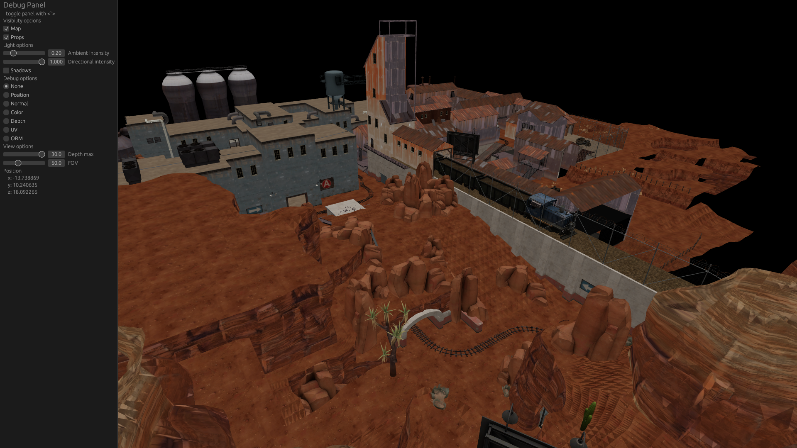

# vbspview

tf2 map viewer based on [vbsp](https://github.com/icewind1991/vbsp)

## Usage

```
cargo run --release -- /path/to/map.bsp
```

In order to load the assets referenced by the map, TF2 needs to be installed locally.

